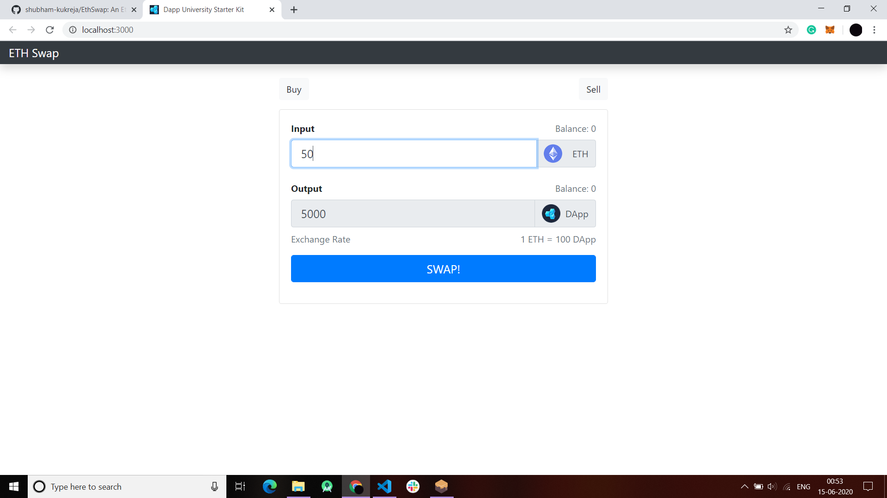

# ETH-Swap Ethereum Stack Exchange (ERC-20 Token)

### A Decentralised Application (DAPP) built on ethereum to trade crypto currency in exchange for DApp Tokens

#### Buy Tokens (ScreenShot) :

#### Sell Tokens (ScreenShot) :

### Procedure to Run Locally :

1. git clone https://github.com/shubham-kukreja/EthSwap.git
2. npm install
3. QuickStart Ganache
4. npm run start (MetaMask Extension Required for trading tokens)
